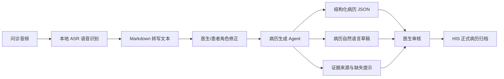

# Medical-record-identification

医患对话病历识别系统，用于把门诊、急诊或复诊过程中的医患语音对话转换为可审核的病历草稿。项目目标不是让 AI 直接写入正式 HIS 病历，而是生成带有来源证据、缺失提示和待医生确认状态的结构化草稿，辅助医生提高病历录入效率。

当前仓库已上传第一阶段能力：本地语音识别转 Markdown 工具。后续会继续接入“转写文本生成结构化病历”的 Agent 服务。

## 项目目标

- 将问诊音频识别为文本。
- 将连续转写文本整理为 Markdown 输入。
- 初步区分医生、患者说话内容。
- 将分角色文本映射为标准病历字段。
- 输出结构化 JSON、病历自然语言文本、字段证据来源和缺失项提示。
- 医生审核确认后，再由 HIS 主系统决定是否归档。

## 总体流程



## 当前已实现

当前仓库包含 `asr_to_md_package/` 独立工具，功能如下：

- 本地 Qwen3-ASR 中文语音识别。
- 默认使用 `Qwen/Qwen3-ASR-0.6B`。
- 支持 `wav/mp3/m4a/webm/flac` 音频上传。
- m4a/aac 音频自动转为 16kHz 单声道后识别。
- 输出 Markdown 转写文本。
- 输出结构化 `segments`，包含 `speaker_role`、`text`、`start_time`、`end_time`、`confidence`。
- 按启发式规则初步拆分“医生/患者”角色。
- 提供中文 Web 页面和命令行脚本。

当前角色拆分是规则推断，适合本地测试和草稿流转；正式使用时建议增加人工修正或接入独立说话人分离模型。

## 待接入模块

后续完整系统会增加以下模块：

- `TranscriptPreprocessor`：清洗转写文本，合并短句，保留角色和时间戳。
- `MedicalFactExtractorChain`：抽取症状、时间、部位、程度、阴性症状、药物、检查、病史、过敏史等事实。
- `RecordFieldMapperChain`：把医学事实映射到病历模板字段。
- `MedicalRecordWriterChain`：生成门诊/急诊病历自然语言草稿。
- `FactGuardChain`：校验每个字段是否能追溯到原始对话，缺失内容标记为“未提及/不详/需医生确认”。

病历生成阶段的状态必须保持为 `draft_pending_review`，不得直接进入正式病历。

## 仓库结构

```text
Medical-record-identification
├─ README.md
├─ .gitignore
└─ asr_to_md_package
   ├─ asr_md
   │  ├─ api.py              # FastAPI 本地 Web 服务
   │  ├─ cli.py              # 命令行入口
   │  └─ core.py             # ASR、音频预处理、Markdown 输出、角色拆分
   ├─ frontend
   │  └─ index.html          # 中文上传页面
   ├─ samples
   │  ├─ medical_consultation_sample.wav
   │  └─ medical_consultation_sample.md
   ├─ download_models.py     # ModelScope 模型下载脚本
   ├─ requirements.txt
   ├─ setup.bat              # 一键安装
   ├─ run_web.bat            # 一键启动 Web
   └─ transcribe_file.bat    # 命令行转写
```

## 环境要求

推荐环境：

- Windows 10/11
- macOS 13 或更高版本，Intel 和 Apple Silicon 均可
- Python 3.10 或更高版本
- 至少 8GB 内存，CPU 可运行
- 首次安装需要联网下载 Python 依赖和模型

当前脚本默认使用 CPU。没有 NVIDIA CUDA 环境时，不建议把设备改成 `cuda`。

## Windows 快速部署

克隆仓库：

```bat
git clone https://github.com/OWENhgvx/Medical-record-identification.git
cd Medical-record-identification\asr_to_md_package
```

首次安装：

```bat
setup.bat
```

安装脚本会完成：

- 创建虚拟环境 `%USERPROFILE%\.asr-md-venv`
- 安装 FastAPI、uvicorn、qwen-asr、torch、modelscope、librosa、soundfile、av 等依赖
- 检查本地是否已有 0.6B 模型
- 没有模型时自动下载 `Qwen/Qwen3-ASR-0.6B`

启动 Web 服务：

```bat
run_web.bat
```

浏览器访问：

```text
http://127.0.0.1:8010
```

上传音频后，页面会显示 Markdown 转写结果、模型名称、耗时和兜底状态。

## macOS 快速部署

macOS 下当前不使用 `.bat` 脚本，直接通过 Python 命令运行。

克隆仓库：

```bash
git clone https://github.com/OWENhgvx/Medical-record-identification.git
cd Medical-record-identification/asr_to_md_package
```

创建虚拟环境：

```bash
python3 -m venv .venv
source .venv/bin/activate
python -m pip install --upgrade pip
```

安装依赖：

```bash
python -m pip install -r requirements.txt
```

如果 `soundfile`、`av` 或音频解码相关依赖安装失败，可以先安装系统音频库：

```bash
brew install libsndfile ffmpeg
```

下载 0.6B 模型：

```bash
python download_models.py \
  --model-root "$HOME/.asr-md-models" \
  --primary Qwen/Qwen3-ASR-0.6B \
  --fallback Qwen/Qwen3-ASR-0.6B
```

启动 Web 服务：

```bash
export ASR_MD_MODEL=Qwen/Qwen3-ASR-0.6B
export ASR_MD_FALLBACK_MODEL=Qwen/Qwen3-ASR-0.6B
export ASR_MD_MODEL_DIR="$HOME/.asr-md-models/Qwen3-ASR-0.6B"
export ASR_MD_FALLBACK_MODEL_DIR="$HOME/.asr-md-models/Qwen3-ASR-0.6B"
export ASR_MD_DEVICE=cpu
python -m uvicorn asr_md.api:app --host 127.0.0.1 --port 8010
```

浏览器访问：

```text
http://127.0.0.1:8010
```

macOS 命令行转写：

```bash
python -m asr_md.cli samples/medical_consultation_sample.wav
```

## 命令行使用

使用示例音频：

```bat
transcribe_file.bat samples\medical_consultation_sample.wav
```

指定输出文件：

```bat
transcribe_file.bat samples\medical_consultation_sample.wav output.md
```

默认会在音频同目录生成同名 `.md` 文件。

## 模型部署

本仓库不提交大模型文件、压缩包和运行时产物，原因是 Qwen3-ASR 模型文件超过 GitHub 普通仓库单文件限制。

默认模型下载位置：

Windows：

```text
%USERPROFILE%\.asr-md-models\Qwen3-ASR-0.6B
```

macOS：

```text
$HOME/.asr-md-models/Qwen3-ASR-0.6B
```

如需离线部署，可以手动把模型放到：

```text
asr_to_md_package\models\Qwen3-ASR-0.6B
```

只要目录内存在 `model.safetensors`，`setup.bat` 和 `run_web.bat` 会优先使用包内模型。

## 可配置环境变量

Windows 示例：

```bat
set ASR_MD_MODEL=Qwen/Qwen3-ASR-0.6B
set ASR_MD_FALLBACK_MODEL=Qwen/Qwen3-ASR-0.6B
set ASR_MD_DEVICE=cpu
set ASR_MD_MODEL_DIR=%USERPROFILE%\.asr-md-models\Qwen3-ASR-0.6B
set ASR_MD_FALLBACK_MODEL_DIR=%USERPROFILE%\.asr-md-models\Qwen3-ASR-0.6B
set ASR_MD_LANGUAGE=zh
set ASR_MD_MAX_NEW_TOKENS=512
set ASR_MD_FALLBACK_THRESHOLD_SECONDS=180
```

macOS 示例：

```bash
export ASR_MD_MODEL=Qwen/Qwen3-ASR-0.6B
export ASR_MD_FALLBACK_MODEL=Qwen/Qwen3-ASR-0.6B
export ASR_MD_DEVICE=cpu
export ASR_MD_MODEL_DIR="$HOME/.asr-md-models/Qwen3-ASR-0.6B"
export ASR_MD_FALLBACK_MODEL_DIR="$HOME/.asr-md-models/Qwen3-ASR-0.6B"
export ASR_MD_LANGUAGE=zh
export ASR_MD_MAX_NEW_TOKENS=512
export ASR_MD_FALLBACK_THRESHOLD_SECONDS=180
```

如果后续机器支持更大模型，可以把 `ASR_MD_MODEL` 和 `ASR_MD_MODEL_DIR` 改为 1.7B 模型。

## Web API

启动 Web 服务后可访问以下接口。

健康检查：

```http
GET /health
```

音频转写：

```http
POST /api/transcribe
Content-Type: multipart/form-data
```

表单字段：

```text
audio_file=<音频文件>
```

响应核心字段：

```json
{
  "model_name": "Qwen/Qwen3-ASR-0.6B",
  "used_fallback": false,
  "fallback_reason": null,
  "duration_seconds": 79.56,
  "elapsed_seconds": 38.5,
  "text": "识别出的完整文本",
  "segments": [
    {
      "segment_id": "asr_0001",
      "speaker_role": "doctor",
      "start_time": 0,
      "end_time": 3.2,
      "text": "您好，哪里不舒服？",
      "confidence": 0.75
    }
  ],
  "markdown": "# 语音识别转写\n\n- 医生：您好，哪里不舒服？\n"
}
```

## Markdown 输出示例

```md
# 语音识别转写

- 医生：您好，哪里不舒服？
- 患者：我咳嗽三天了，还有点发烧。

## 识别信息

- 模型：Qwen/Qwen3-ASR-0.6B
- 是否使用兜底模型：否
- 音频时长：79.56 秒
- 识别耗时：38.50 秒
```

## 常见问题

### 1. setup.bat 下载模型失败

优先检查网络和 ModelScope 访问。如果网络不稳定，可以手动下载 `Qwen/Qwen3-ASR-0.6B`。

Windows 离线模型目录：

```text
asr_to_md_package\models\Qwen3-ASR-0.6B
```

macOS 推荐模型目录：

```text
$HOME/.asr-md-models/Qwen3-ASR-0.6B
```

### 2. 识别 m4a 失败

当前工具已内置 PyAV 兜底转码。请确认依赖安装完整：

```bat
%USERPROFILE%\.asr-md-venv\Scripts\python.exe -m pip install -r requirements.txt
```

### 3. 第一次识别很慢

第一次请求会加载模型，CPU 环境耗时较长。同一个 Web 服务进程内，后续请求会复用已加载模型。

### 4. 医生/患者角色不完全准确

当前是启发式规则拆分，不是声纹级说话人分离。用于病历生成前，建议在前端增加人工修正步骤。

## 安全边界

- 本工具只生成转写文本和草稿输入，不直接写入正式 HIS 病历。
- 音频和转写结果默认在本地处理。
- 正式病历必须由医生审核确认。
- AI 生成诊断只能作为“初步建议/待医生确认”，不得作为最终诊断。
- 缺失或对话中未提及的信息不得自动补写。

## 开发计划

- 上传并整合病历生成 FastAPI 服务。
- 将 Markdown 转写文本转换为标准 `TranscriptSegment`。
- 增加可编辑的医生/患者角色修正页面。
- 引入 LangChain 病历生成 Agent。
- 输出结构化 JSON、自然语言病历、字段证据来源和缺失提示。
- 增加单元测试和典型问诊场景测试。
